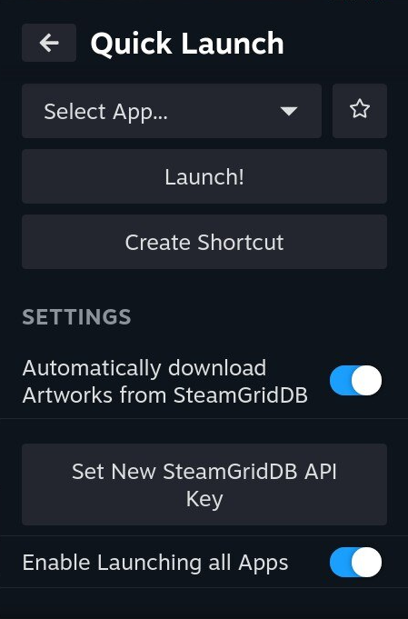

> [!WARNING]  
> Soft deprecation notice: I unfortunately do not have the resources to reliably update this plugin anymore - it'll stay up for as long as it works, but if it ever breaks i cant promise i'll be able to fix it again. I'm therefore looking for someone to take over maintaining this plugin, feel free to reach out! (here or via the Steam Deck Homebrew Discord)

# SDH-QuickLaunch
[Decky Loader](https://github.com/SteamDeckHomebrew/PluginLoader) Plugin to quickly launch Apps from the Quick Access Menu without adding them as shortcuts, and add new shortcuts entirely

## Tips
- Feel free to hide the QuickLaunch Shortcut this creates from your library, it wont affect the functionality
- To obtain a SteamGridDB API Key, login/register at [SteamGridDB](https://www.steamgriddb.com/). You can then generate an API Key [here](https://www.steamgriddb.com/profile/preferences/api) 

## Caveats
You can only have one application open at at time
